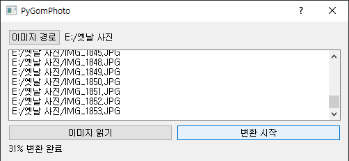
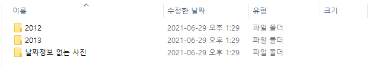
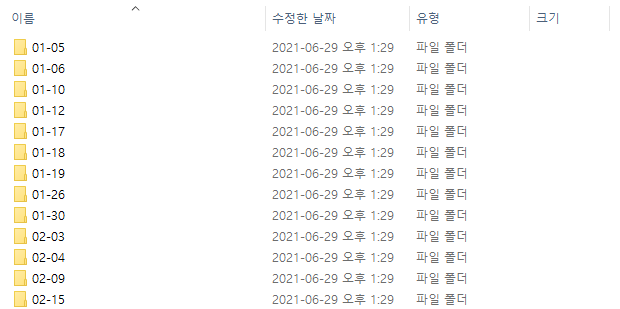

# PyGomPhoto

폴더에서 이미지를 검색하고 이미지를 촬영 날짜에 따라 정리합니다. [GomPhoto](http://whria.net/photo/)의 파이썬 버전입니다.

### 다운로드
[여기](https://github.com/Hydragon516/PyGomPhoto/releases)에서 최신 버전의 PyGomPhoto.exe를 다운받아 실행합니다.

### 업데이트
* 2021/06/29 - 최초 커밋
* 2021/07/03 - 동영상 정리 기능 추가
